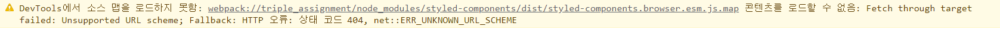
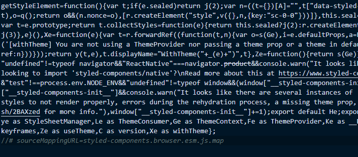

# Triple Assignment

## 🙋🏻‍♂️Applicant

**Jung Young Jun**

[](https://avatars.githubusercontent.com/u/83502672?v=4)

[github](https://github.com/dudwns0921)

## 🧑🏻‍💻 Tech stack

요구사항에 명시된 기술 스택들을 제외한 나머지는 **단순히 UI 하나만을 구현**하는 것이 아니라 트리플의 애플리케이션을 **실제로 만든다는 관점**에서 선택했습니다. 트리플과 같이 크고 복잡한 애플리케이션을 만들 때 고민해야 하는 부분은 결국 **생산성**이라고 생각했고, 이 부분에 초점을 맞추고 기술들을 선택했습니다. 

### `Front-end :`  

	

과제 요구사항에 맞게 사용했습니다.

   

#### styled-components

현재 웹 애플리케이션 스타일 구성 방식은 크게 `CSS-in-JS`와 `CSS-in-CSS`로 나누어집니다. 먼저 `styled-components`가 포함된 `CSS-in-JS`를 선택한 이유는 총 2가지 이유 때문입니다.

- **별도로 CSS 파일을 관리할 필요 없음**

`CSS-in-CSS`를 사용하게 되면 `styled-components`처럼 컴포넌트 한 곳에서 모든 것을 작성하지 않기 때문에 별도로 많은 CSS 파일을 만들어 관리해야 하는 단점이 있습니다.

실제로 소규모 프로젝트를 진행할 때, `CSS-in-CSS`를 사용하면서 수십 개에 달하는 CSS 파일들을 작성해야만 했습니다. 만약 대규모 프로젝트라면 수백 수천 개의 CSS 파일을 따로 관리해야 할 것입니다. 이는 꽤 복잡하며 매번 수정할 때마다 각 컴포넌트에 해당하는 CSS 파일을 찾아야 하므로 작업의 효율성도 떨어지리라 생각합니다.

- **손쉽게 `SCSS` 문법 활용 가능**

프로젝트 규모가 커지면 CSS는 불가피하게 가독성이 떨어지는 등 유지보수의 어려움을 주는 요소가 됩니다. 코드의 재활용성을 올리고, 가독성을 올리는 등 CSS에서 보이던 단점을 보완하고, 개발의 효율을 올리기 위해 등장한 개념이 바로 `CSS 전처리기`입니다.

CSS 전처리기는 특정한 문법을 활용해 작성된 코드를 다시금 순수 CSS 코드로 바꾸어주는 역할을 합니다. 그중에서도 가장 많이 사용되는 전처리기가 `SCSS`입니다.

`CSS-in-CSS`안에서 `SCSS` 문법을 사용하기 위해서는 `SCSS`를 별도로 설치해주어야 합니다. 다시 말하면, 스타일을 정의하는 작업과 전처리기를 통해 다시 순수한 CSS 코드로 컴파일해주는 작업을 모두 사용자가 감당해야 합니다.

반면에 `styled-components`는 스타일링 프레임워크로서 이미 `stylis`라는 전처리기를 사용해 `SCSS` 유사 문법을 지원하고 있습니다. `styled-components` 하나만 설치하는 것으로도 `SCSS` 문법을 손쉽게 사용할 수 있다는 것입니다.

#### Typescript

 `Javascript` 대신 `TypeScript`를 사용한 이유는 아래와 같습니다.

- **보다 빠른 버그 발견**

`TypeScript`는 정적 타입 시스템을 도입한 자바스크립트입니다. 정적 타입 시스템이 있는 언어, 즉 정적 타입 언어에서는 프로그램의 예상 동작을 타입을 통해 나타내고, 그 예상에 걸맞게 동작할 지의 여부를 타입 검사기를 통해 실행 전에 확인할 수 있습니다.

반면에 `Javascript`와 같은 동적 타입 언어에서는 같은 종류의 오류가 코드 리뷰, 심지어는 실제 배포가 일어날 때 까지도 안 발견되는 경우도 잦습니다. 소프트웨어 개발 과정에서는 오류가 늦게 발견 될수록 더 큰 금전적, 시간적 비용을 치루어야 하므로 이는 매우 큰 이점입니다.

- ##### 코드 가이드 및 자동완성(개발 생산성 향상)

`TypeScript`를 사용해야 하는 또 다른 이유는 코드를 작성할 때 개발 툴의 기능을 최대로 활용할 수 있다는 것입니다. 최근 프론트엔드 개발을 할 때 가장 많이 사용되는 `Visual Studio Code`는 툴의 내부가`TypeScript`로 작성되어 있어 `TypeScript` 개발에 최적화 되어 있습니다. 다음 예시를 살펴보겠습니다.


변수 `total`에 대한 타입이 지정되어 있기 때문에 `Visual Studio Code`에서 해당 타입에 대한 API를 미리 보기로 띄워줄 수 있고 따라서, API를 다 일일이 치는 것이 아니라 자동완성을 통해 정확하게 빠르게 작성할 수 있습니다.

### `Environment :`

  

과제 요구사항에 맞춰 적용했습니다.

 

#### Webpack

저는 번들러로는 `Webpack`을 선택했습니다. 가장 많이 사용되는 번들러는 아래 3가지이며, 각 번들러마다 적합한 상황이 존재합니다.

- **Webpack** : 많은 서드 파티를 필요로 하는 복잡한 애플리케이션
- **Rollup** : 최소한의 서드 파티를 사용하는 라이브러리
- **Parcel** : 복잡한 설정이 필요없는 비교적 간단한 애플리케이션

트리플은 많은 서드 파티를 필요로 하는 복잡한 애플리케이션에 해당하기 때문에 `Webpack`을 사용하는 것이 적합합니다. 그리고 개발 생산성을 향상할 수 있는 `Webpack`의 장점들 또한 판단의 기준이 되었습니다.

- **오래된 만큼 다양한 플러그인과 로더를 통해 개발자에게 광범위한 지원**
- **다른 번들러에 비해 뛰어난 개발 서버**
  - 개발 중 변경사항을 자동으로 새로고침해주는 라이브 리로딩 기능 지원
  - 새로고침 없이 런타임에 브라우저의 모듈을 업데이트하는 핫 모듈 교체 기능 지원

#### Babel

여러 자료들을 찾아본 결과 컴파일러로는 일반적으로 `Babel`, 아니면 `Typescript`를 사용하는 것으로 알고 있습니다. 아래와 같은 이유로 `Babel`을 선택했습니다.

- **쉬운 설정**

`Babel`은 `Typescript`보다 설정이 훨씬 간편합니다. 특히 `preset`을 사용하는 것으로 세부적인 설정을 할 필요 없이 어떤 구문이라도 쉽게 컴파일을 할 수 있습니다. 반면에 `Typescript`는 사용자가 설정 옵션을 하나하나 확인해가면서 설정을 진행해야 합니다.

- **타입스크립트 구문 무시**

`Babel`은 `Typescript` 구문을 무시해버리고 일반 `Javascript` 코드로 변환시킵니다. 그래서 굉장히 빠른 컴파일 속도를 가지며, 타입 체크때문에 발생할 수 있는 에러를 확인하지 않아도 됩니다. 다시 말하면, 별도의 타입 체크를 하기 전까지는 개발자는 온전히 개발에 집중할 수 있습니다.

이와 달리 `Typescript`를 사용하는 개발자들은 일반적으로 느린 컴파일 시간을 경험할 수밖에 없습니다. 왜냐하면 `Babel`과 달리 `Typescript`는 타입 체크를 통해 모든 코드가 제대로 작성되었는지 확인하는 과정을 거치기 때문입니다. 그리고 이 느린 컴파일 시간은 작업의 효율성을 떨어뜨립니다.

따라서 나중에 별도의 타입 체크만 이루어진다면 바벨을 통해 빠르게 개발을 하고 이후에 타입스크립트를 통해 미세한 오류들을 체크해 수정하는 것이 개발 생산성 측면에서 훨씬 좋다고 봅니다.

## 📒 Usage

### 개발 모드로 실행하기

```
> npm run dev
```

### 타입 체크하기

```
> npm run check-type
// 컴파일은 babel로 이루어지기 때문에 별도의 타입 체크를 위한 명령어를 만들었습니다.
```

### 빌드하기

```
> npm run build
// '프로젝트 폴더/dist'에 빌드 결과물 생성
```

# 🤔기타 참고사항

개발 모드에서 실행할 경우 다음과 같은 에러가 발생할 가능성이 있습니다.



## 해결 방법

> 프로젝트 폴더\node_modules\styled-components\dist\styled-components.browser.esm.js

	

주석 처리된 부분의 코드를 삭제해주면 해결이 되는 문제입니다. 관련 이슈에 대한 스택오버플로우 링크입니다. 

https://stackoverflow.com/questions/21773376/bootstrap-trying-to-load-map-file-how-to-disable-it-do-i-need-to-do-it

# :books:참고자료

- styled-components 관련 자료

https://css-tricks.com/demystifying-styled-components/

https://blog.logrocket.com/benefits-using-styled-components-react/

- 타입스크립트 관련 자료

https://www.typescriptlang.org/docs/handbook/typescript-from-scratch.html

[Why TypeScript? | 타입스크립트 핸드북](https://joshua1988.github.io/ts/why-ts.html#%EC%99%9C-%ED%83%80%EC%9E%85%EC%8A%A4%ED%81%AC%EB%A6%BD%ED%8A%B8%EB%A5%BC-%EC%8D%A8%EC%95%BC%ED%95%A0%EA%B9%8C%EC%9A%94)

https://ahnheejong.gitbook.io/ts-for-jsdev/01-introducing-typescript/static-type-analysis

- 웹팩 관련 자료

https://webpack.js.org/

https://yozm.wishket.com/magazine/detail/1261/

https://betterprogramming.pub/the-battle-of-bundlers-6333a4e3eda9

- 바벨 및 타입스크립트 관련 자료

https://iamturns.com/typescript-babel/

https://blog.logrocket.com/babel-vs-typescript/